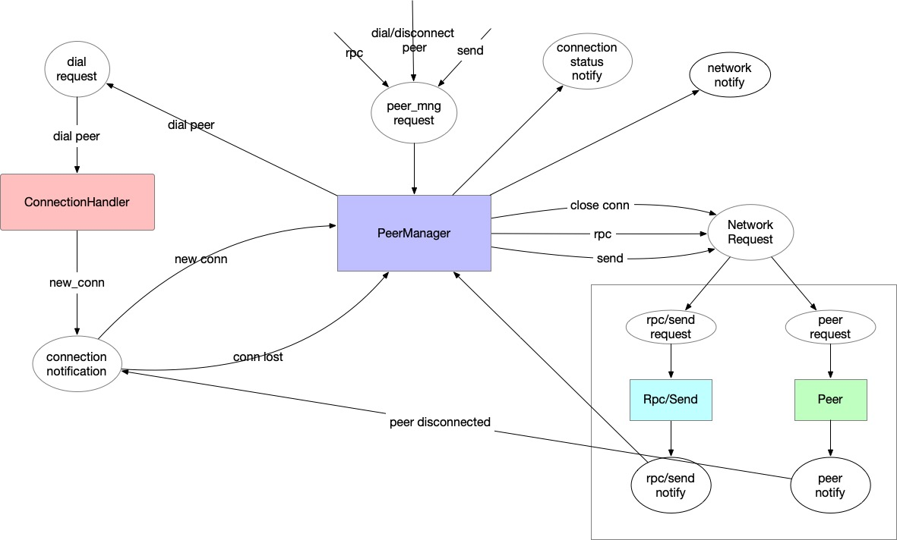

最近看了下 libp2p 的代码，用 libp2p 实现了 libra network 中的 rpc 协议，代码在[这里][1]。对 libp2p 算比较熟悉了。
今天又重新过了下 libra network 的代码。

虽然它主要还是沿用 libp2p，但使用 actor model 来实现，更加 async/await，整个模型相比 libp2p 更加轻量。
相比 libp2p 通过各种 hook，libra network 通过 channel 来传递消息（也丧失了部分灵活性）。

为了总结 actor 之间的关系，画了下面一张图。

[1]: https://github.com/nonsense2020/libp2p-rpc
